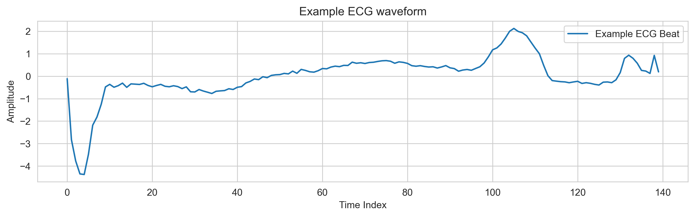
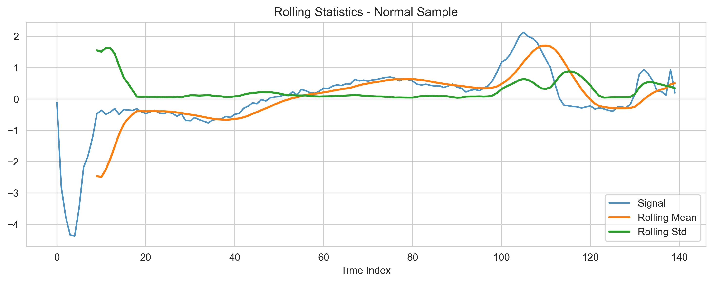
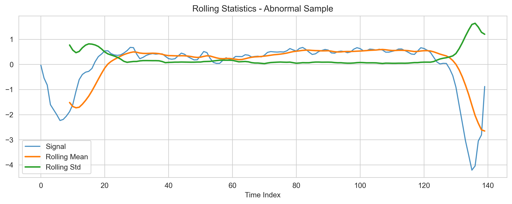
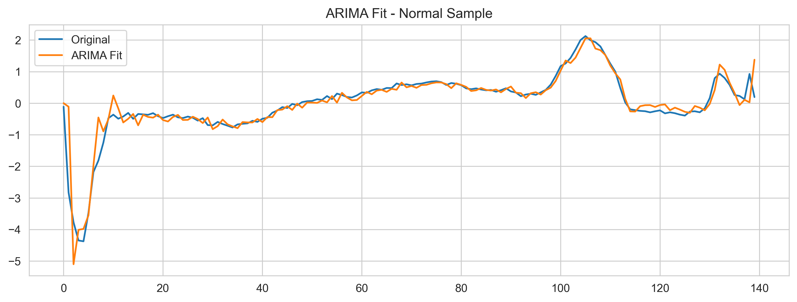
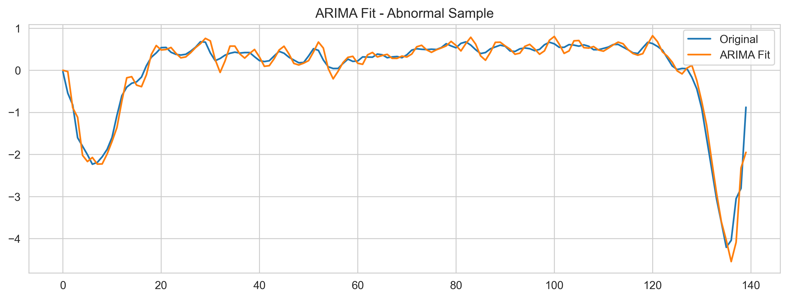
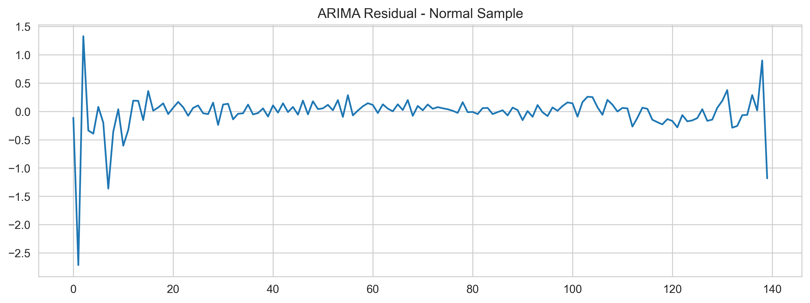
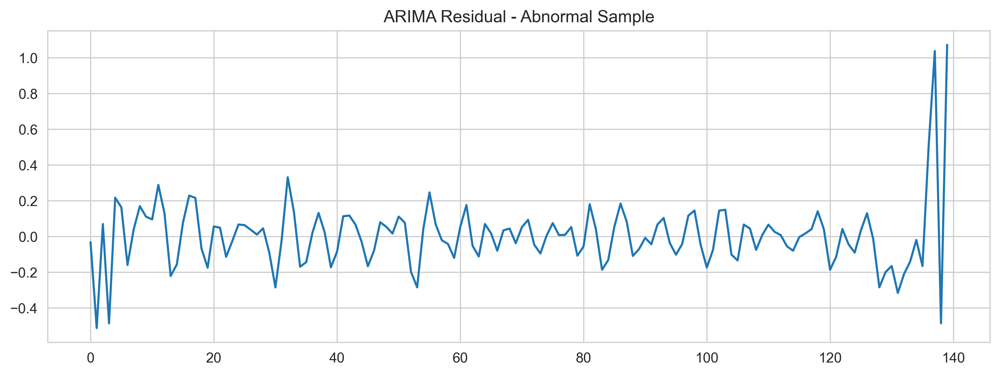
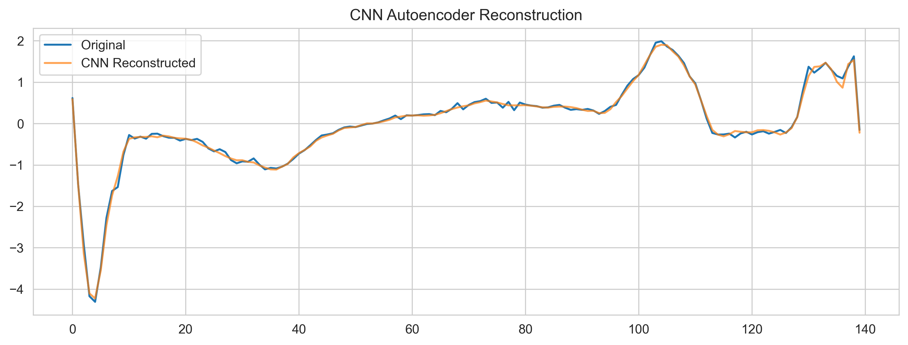
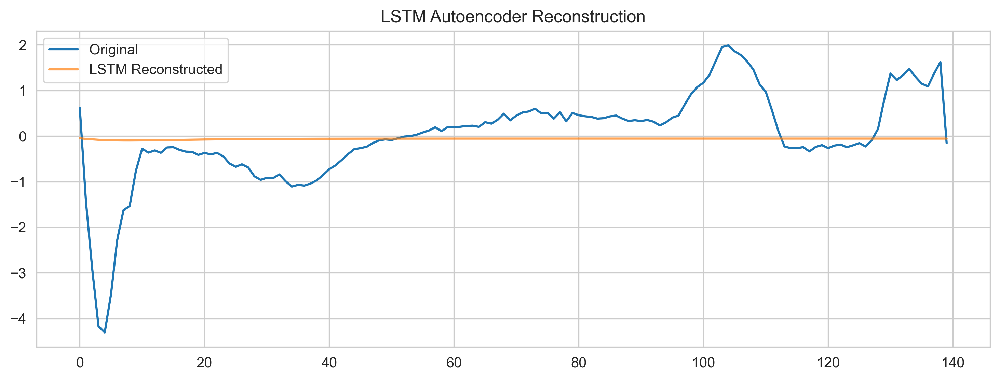

# ECG5000 – ECG Arrhythmia Detection using Machine Learning and Deep Learning

## 1. Project Overview
This project performs a comprehensive analysis of the ECG5000 dataset, combining **biomedical signal processing, statistical time-series analysis, classical machine learning, and deep learning autoencoders** to study arrhythmias from single-lead ECG signals.  

The goals are to explore and benchmark different approaches for **binary classification of normal vs arrhythmic beats** and to investigate **signal reconstruction with autoencoders** for further insights.

---

## 2. Dataset
- **ECG5000 dataset**: Contains 5000 single-lead ECG heartbeats, each with 140 time-series points plus a class label.  
- **Data shape**: `(5000, 141)`  
- **Class distribution (after binary mapping)**:
  - Class 0 (Normal): 2919 samples  
  - Class 1 (Arrhythmia / Abnormal): 2081 samples  
- **Binary task**: Map original labels so that Normal beats = 0 and all other arrhythmic beats = 1

---

## 3. Problem Definition
**Task:** Perform binary classification of ECG heartbeats as Normal or Arrhythmic.  

**Methods implemented in this project:**
1. Statistical analysis of ECG signals, including rolling statistics, ADF test, and ARIMA modeling.  
2. Feature extraction from ECG signals (HRV metrics) combined with classical machine learning classifiers: Random Forest, SVM, and Logistic Regression.  
3. Deep learning autoencoders (CNN and LSTM) for ECG signal reconstruction to study waveform patterns.

---

## 4. Methodology / Pipeline

1. **Data Loading & Preprocessing**
   - Combined training and test sets into a single dataset  
   - Applied binary label mapping: Normal = 0, Arrhythmic = 1  
   - Standardized features/signals for ML and DL models

2. **Statistical Time-Series Analysis**
   - Computed rolling mean and standard deviation  
   - Conducted Augmented Dickey-Fuller (ADF) test for stationarity  
   - Analyzed autocorrelation (ACF) and partial autocorrelation (PACF)  
   - Fitted ARIMA models and examined residuals

3. **Feature Extraction**
   - Applied bandpass filtering (0.5–8 Hz) to ECG signals  
   - Extracted HRV-related features: mean heart rate, heart rate variability, and peak counts  

4. **Classical Machine Learning**
   - Trained Random Forest, SVM, and Logistic Regression classifiers  
   - Evaluated models using Precision, Recall, and F1-score  

5. **Deep Learning**
   - Built CNN and LSTM autoencoders to reconstruct ECG waveforms  
   - Studied reconstruction patterns to analyze signal morphology

---

## 5. Results

### 5.1 Plots

**Example ECG waveform:**  
Illustrates a single heartbeat from the dataset.  

**Rolling statistics (mean ± std):**  
Shows short-term trends and variability in ECG signals.  

- **Normal sample**  
  

- **Abnormal sample**  

**ARIMA fit & residuals:**  
Fitted ARIMA models capture the overall signal trends, while residuals highlight the variance not explained by the model.  

- **Normal sample (Fit)**  
  

- **Abnormal sample (Fit)**  
  

- **Normal sample (Residuals)**  
  

- **Abnormal sample (Residuals)**  

**CNN & LSTM Reconstruction:**  
Deep learning autoencoders trained to reconstruct ECG heartbeats, illustrating model capability on normal and abnormal signals.

- **CNN Autoencoder**  
  

- **LSTM Autoencoder**  

---

### 5.2 Statistical Analysis
- **ADF Test**
  - Normal: ADF = -1.8, p-value = 0.34 → Non-stationary  
  - Abnormal: ADF = -4.4, p-value = 0.002 → Stationary
- **ARIMA Residual Variance**
  - Normal: 0.11  
  - Abnormal: 0.037  

---

### 5.3 Classical Machine Learning

| Model | Precision | Recall | F1-score |
|-------|----------|--------|----------|
| Random Forest | 0.92 | 0.80 | 0.86 |
| SVM           | ~0.90 | ~0.78 | ~0.84 |
| Logistic Regression | 0.89 | 0.06 | 0.11 |

**Insights:**  
- Random Forest performed best overall  
- Logistic Regression achieved high precision but extremely low recall, failing to detect most arrhythmic samples

---

### 5.4 Deep Learning Autoencoders
- **CNN Autoencoder:** accurately reconstructed ECG signals; good for anomaly detection  
- **LSTM Autoencoder:** failed to reconstruct signals; predictions nearly flat (~0)  

---

## 6. Key Takeaways
- Arrhythmic samples are statistically different from normal beats (ADF, ARIMA residuals)  
- HRV-based features + classical ML (Random Forest) provide strong classification performance  
- CNN autoencoder is effective for ECG reconstruction, while LSTM autoencoder failed on this dataset  
- Logistic Regression is unsuitable for this imbalanced binary classification without additional handling  

---

